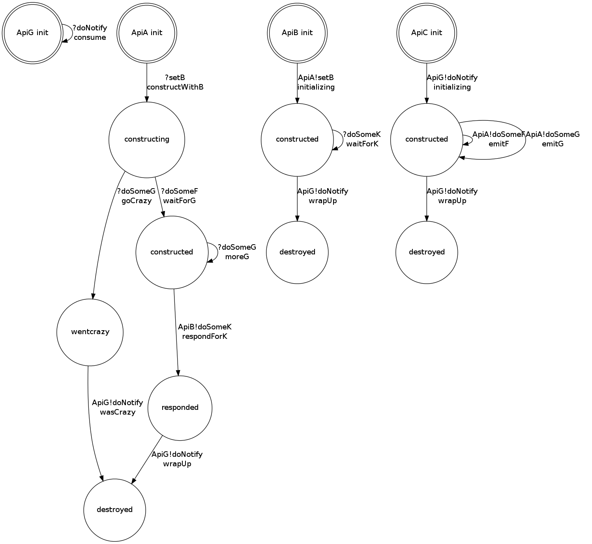
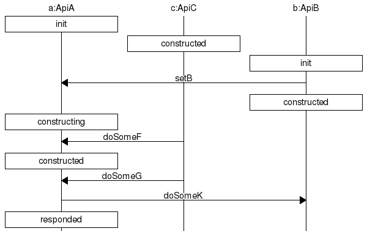

iface
=====

Generate FSM, Sequence Diagram, and a set of header files from a short interface description

The "if" language is implemented here in a small Python script.  It generates
other representations like this state machine (showing multiple interacting APIs):

[Alt State Machine description](example.if.dot)

And this Sequence Diagram (of which many could be generated, as they are instances
of whatever the state machines allow):

[Alt Sequence Diagram description](example.if.Case1.msc)

From this description:

[An If File](example.if)

Which generates these (currently pseudo-Java) headers:

[An Interface Definition](example.if.java)

When dealing with writing code, little attention is currently paid to the fact that each
API has state, where each function in that API has preconditions that restrict the allowable
calling order for the methods in that API.  Having such well defined ordering gives us
what is called a Protocol.  

When this ordering is exactly defined such that the compiler
can reject all unforeseen uses, the API has a new layer of _defense_, by denying the attacker
a space of _undefined states_ for it.  This is very similar to the concept of _LANGSEC_,
where input must be recognized as being in the language of the API before it will be parsed.
In this view, the correct message ingest of actors must be _decideable_.  APIs are treated
similar to Communicating Sequential Processes (CSP).  Each instance of an API has state,
and they exchange messages through their input message queue. 

The script is similar in concept to Ragel, except it is explicitly modelling interactions
between isolated state machines.  Without this, sequence diagrams cannot be enforced.

The basic rule is to never invoke any function until the preconditions for the invoke are met.
That means that not only are the input types satisfied, but that preconditions take
input values into account and the current state of the API.  In this view, the states in
the state machine really represent the preconditions that must be true, in combination
with expected interactions with other APIs.

Because of this, the API is modeled as message passing state machines.  Every transition
in the state machine either ingests an input message (transforming from its precondition
to its postcondition), or emits an output message (transforming from its precondition
to its postcondition).  In this way, we capture all externally observable state changes
in a state machine.  This is enough information to automatically generate:

* The header files for each module (Java-like interfaces for this POC)
* The overall communicating state machines
* Include required traces _in the interface definitions_ themselves
* Proxy the modules so that all pre and post condition checks can be moved into
  the proxy and completely out of the implementation
* Proxy the modules so that evan blank stubs can pass behavioral unit tests
* Proxy the modules so that logging can go there (logging all message passing and state
  transitions) rather than in the implementation code
* The full dependency diagram between components.  What we import is just as
  important as what we export.

We assume that if a function is _ever_ invoked before its preconditions are met, 
that it crashes after exposing a horrible security _vulnerability_.
The postconditions and explicitly handling message sending (rather than only noting
what an API will accept) are the parts that are usually missing from interface definitions.
Without them, we have to stop being explicit at defining callable functions; and
get into drawing ambiguous diagrams that are not machine checkable.

Approximations
==============

* Only given a set of C header files with weak types, we can impose interfaces between modules.
But the interfaces end up being extremely ambiguous.  

* In Object Oriented programming without DesignByContract we get partially supported Protocols
because the type systems enforce some of the preconditions for every function.  Using strong
types alone, we can come close to imposing a regular expression grammar over the allowable
sequence of calls to an API.  But we still can't reach the ideal of disallowing the call
of a function with unmet preconditions.

* With DesignByContract, we get quite a bit closer because we can ensure that no function
with unmet preconditions gets invoked, while also implying what the next state needs to be.
Without the postconditions, we can't define the state machines.  Without state machines,
we can't check the sequence diagrams.

* With Typestate (the approach taken here), the preconditions are implicitly hidden in the
state machines.  Each distinct state is not a configuration of all variables in the API,
but are externally distinguishable pre and post condition combinations. 

* DependentTypes are the ideal, where the type system itself is strong enough to specify
pre and post conditions exactly.  With dependent types, the type depends on the value of
the object.  This is the fullest power available, such that code can be proven logically
consistent.  No attempt to use dependent types is made.  But note that DesignByContract
provides a weak form of it that has many of the same advantages.

The Language
============

The "if" language is as simple as it can possibly be from a parsing perspective.
The language is completely regular, meaning that it can be parsed by a regular expression.
It does this by avoiding the need to balance nested constructs (begin, end, etc).
Variable length lists of things are always placed last to keep the grammar regular.
That means that return values are no optional, and parameters get specified last.

An "if" file is a sequence of modules and interactions, with keywords having an ampersand
to mark them.

This is a module named ApiA with start state init and final state destroyed.  The
name is a type name that will end up being the interface name for the module.

* @Module ApiA init destroyed

When a module is being defined, an input message with name, return type, arg types are specified:

* @In doSomeF F X
* @In doSomeG G Y
* @In cosine floatFromMinusOneToPlusOne float

The input messages are literally the functions that get invoked on the API.  Almost
every methodology stops here; which is why state machines and interaction diagrams
are markerboard-only phenomena that don't survive into the code.  The dual 
of @In messages is the @Out messages.  With them, we are able to encode how
modules depend on each other, and are able to literally check interactions for
overall correctness (such that no module tries to use another modules function
in a way that violates its preconditions).

It is similar except between the type declaration for the return type and the args,
in insert the type of the receiver (ie: self):

* @Out doSomeF F ApiA X
* @Out doSomeG G ApiA Y
* @Out cosine floatFromMinusOneToPlusOne ApiA float

When one state machine invokes an @Out, the call blocks until the receiver state machine
transitions on its @In.  This is slightly different from CSP here.  We assume that
all actors simply consume an input message queue, and one @Out corresponds to one @In.
@In corresponds to code executing as the state machine transitions from pre to post
state as it parses input.  @Out corresponds to code executing as the state machine transitions
from pre to post state as it sends the input.

These @In and @Out functions just represent the messages being sent with no regard for the
state machines.  The @Move is an instance of a usage of either an @In or an @Out giving
the specific pre and post states.  Again, because the "if" language is regular, the
function call is placed last because of its variable length.

This means that there is a transition called "respondForK" that moves from the constructed
to the responded state, and will invoke bArg's message doSomeK(x) and call the result k.

* @Move respondForK constructed responded Out doSomeK k bArg x

In messages corresond to places where the API blocks and is stuck waiting for input
from the outside.  Out messages correspond to event handling hooks.  When moving through
a state machine, these are all distinct concepts with different listeners:

* Exit pre state
* Move to post state invoking f
* f is invoked
* Enter post state

Interactions are an addition to modules that exist to give names to sequences of events
between actors, and to be able to _check_ that they are possible.  We are here specifying
the overall correctness of the system.  It would also be here we we would specify state
transitions to ensure that some sequences put the API into the destroyed state.

TODO
====

There should be a notion of @Spawn such that the entire system can be specified to
include the top level program that instantiates the objects and injects their dependencies
into each other to get them started.  I have done this with some hand created dot files,
but not accounted for this in the grammar.

This is all conceptually similar to Erlang, which uses tail recursion to specify regular
state machine changes (and non-tail calls create a sub-state machine).  There, everything
is communicating state machines, and explicitly modelling spawn dramatically simplifies
reasoning about how the system is wired together. 
